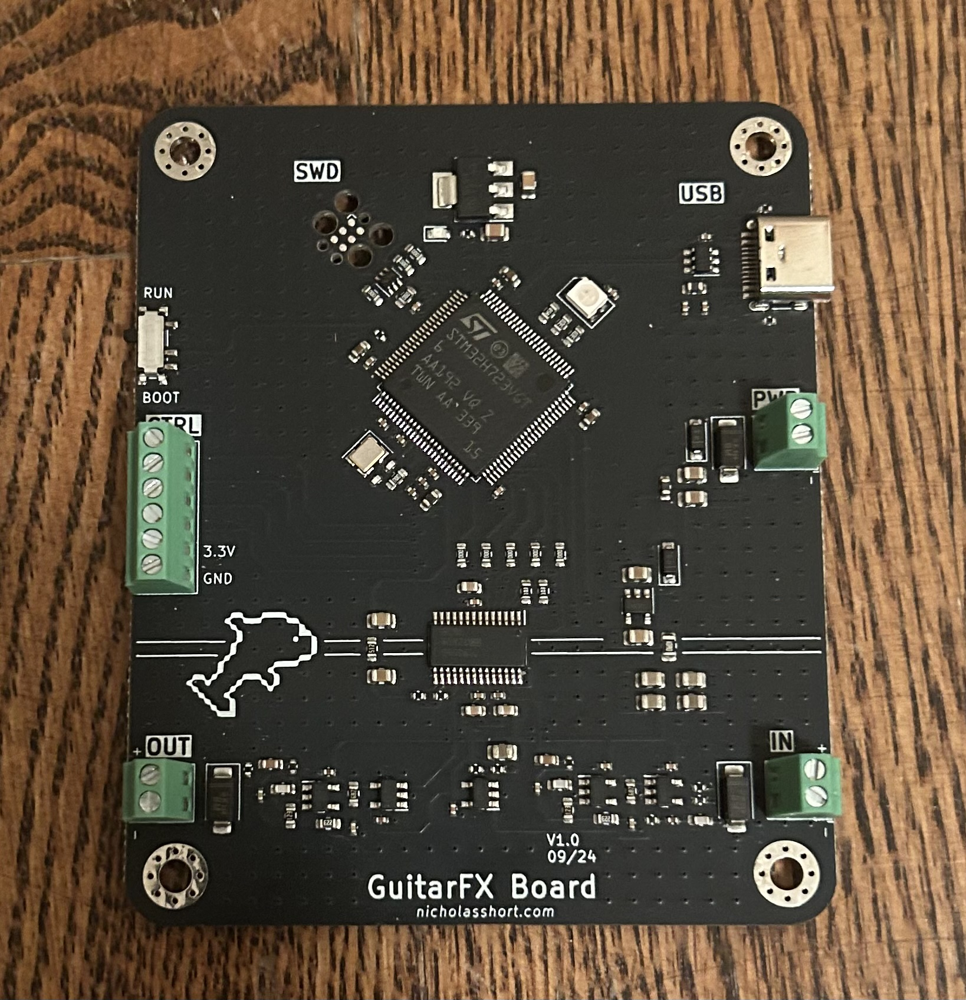
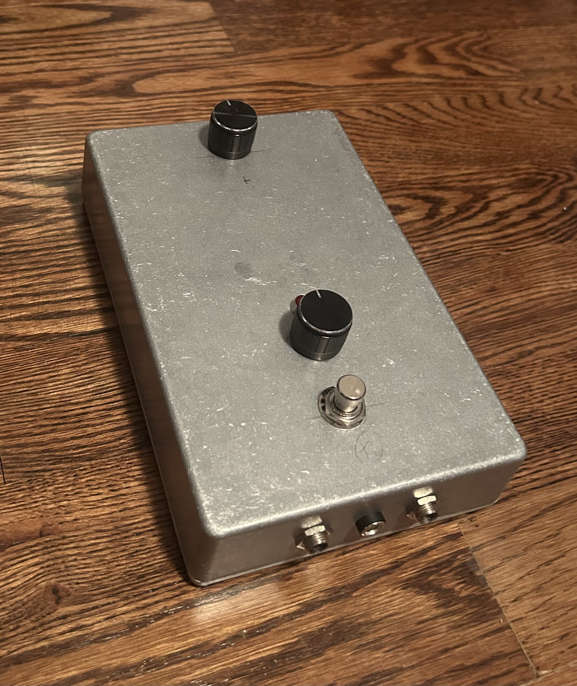

# GuitarFX

This is a digital guitar effects pedal designed as a generic DSP platform. I've written simple algorithms such as volume and tone control, however plans are in the works for others: namely hard and soft clipping, digital delay, and much more. The two knobs control various parameters within the current algorithm, including volume or cutoff frequency.

## Hardware

- **MCU**: STM32H723VGT6 (Cortex-M7 @ 550 MHz)
- **Codec**: TI PCM3060 — 24-bit stereo ADC/DAC
- **Analog I/O**: TLV9161 op-amp buffers with 25 kHz Butterworth anti-aliasing and reconstruction filters
- **Audio**: Standard 1/4" guitar input and output, true-bypass footswitch
- **Controls**: 2 × potentiometers, RGB status LED
- **Power**: 9 V DC barrel jack (USB-C can also power the board for bench work)
- **PCB**: 4-layer, KiCad

## Repository layout

- `GuitarFX-PCB/` — KiCad project (schematics, board, libraries)
- `GuitarFX-PCB/Manufacturing/` — Gerbers, BOM, and pick-and-place files for JLCPCB
- `images/` — Photos of the board and enclosure
